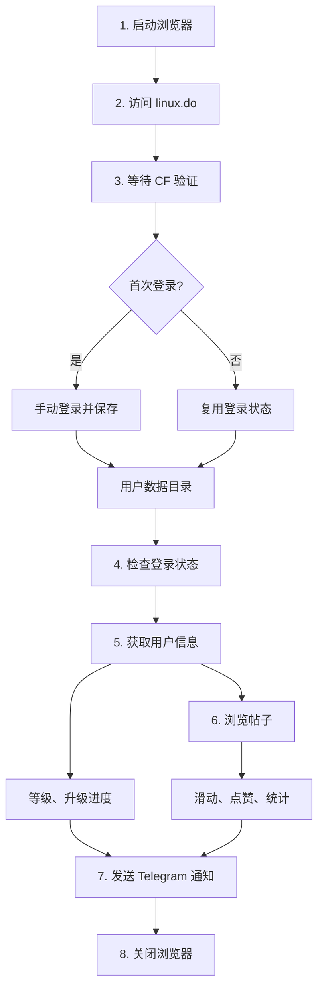
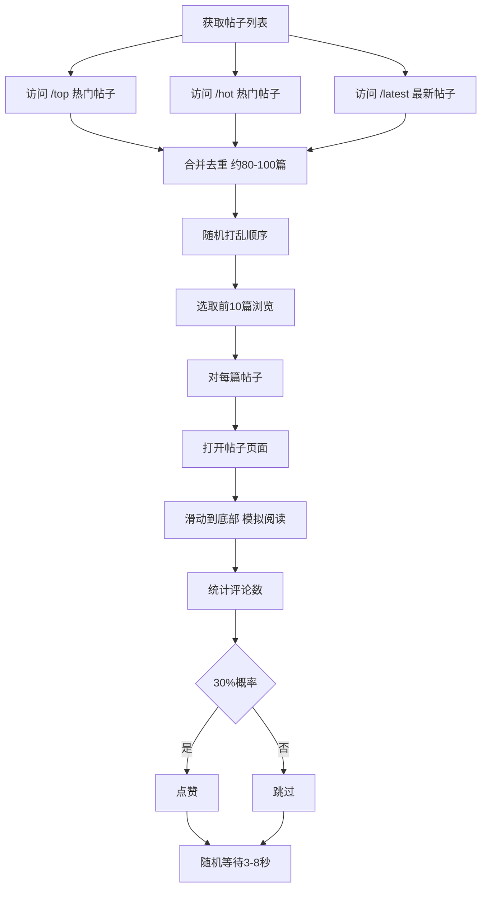
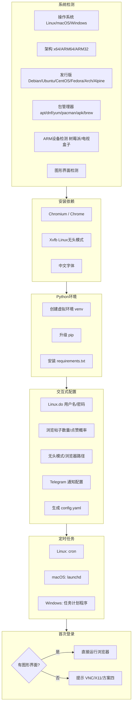
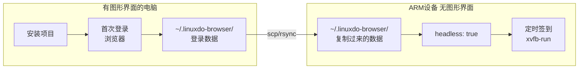

# LinuxDO 自动签到工具

> 自动浏览 Linux.do 论坛帖子，模拟真实用户行为，帮助完成每日活跃任务。

## 目录

- [更新日志](#更新日志)
- [工作原理](#工作原理)
- [签到流程](#签到流程)
- [功能特性](#功能特性)
- [支持平台](#支持平台)
- [一键安装](#一键安装)
- [快速开始](#快速开始)
- [方案详解](#方案详解)
  - [方案A：Windows 任务计划](#方案awindows-任务计划)
  - [方案B：macOS launchd](#方案bmacos-launchd)
  - [方案C：Linux cron](#方案clinux-cron)
  - [方案D：Docker 部署](#方案ddocker-部署)
  - [方案E：青龙面板](#方案e青龙面板)
  - [方案F：ARM 设备部署](#方案farm-设备部署)
  - [方案G：二进制安装](#方案g二进制安装)
- [配置说明](#配置说明)
- [Telegram 通知](#telegram-通知)
- [常见问题](#常见问题)
- [故障排除](#故障排除)
- [项目结构](#项目结构)
- [免责声明](#免责声明)

---

## 更新日志

### v0.3.5 (2026-02-04) - 启动时自动检查更新

**重要改进：所有入口点启动时自动检查更新**

> 之前版本的更新检测只在执行签到任务时提示，但签到完成后会自动退出，导致更新无法执行。
> 现在所有脚本启动时就会检查更新，用户可以选择是否立即更新。

| 入口点 | 更新检测 | 说明 |
|--------|----------|------|
| `main.py` | ✅ 启动时检查 | 发现新版本时询问是否更新 |
| `install.py` | ✅ 启动时检查 | 显示主菜单前检查更新 |
| `Windows.cmd` | ✅ 启动时检查 | 新增菜单选项 7: 检查更新 |
| `linuxANDmacos.sh` | ✅ 启动时检查 | 新增菜单选项 9: 检查更新 |

**更新流程：**
```
启动脚本 → 检查更新 → 发现新版本 → 询问是否更新 [Y/n]
                                    ↓
                              Y: 执行更新 → 退出（重新运行）
                              n: 跳过 → 继续正常使用
```

**一键安装脚本版本：** v1.3.0

### v0.3.4 (2026-02-04) - 自动更新功能

**新增 `--check-update` 自动更新功能：**

| 功能 | 说明 |
|------|------|
| 自动检测安装方式 | 区分 git clone、预编译二进制、源码安装 |
| git 安装自动更新 | 执行 `git pull origin main` 更新 |
| 二进制自动更新 | 下载新版本并替换（支持进度显示） |
| 本地修改保护 | git 更新前自动 stash 本地修改 |
| Windows 兼容 | 生成更新脚本，关闭程序后执行替换 |

**使用方法：**

```bash
# 检查并更新
python main.py --check-update

# 或直接运行（启动时会提示有新版本）
python main.py
```

**更新流程：**
1. 检测当前版本和最新版本
2. 显示更新内容
3. 选择更新方式：自动更新 / 打开下载页面 / 取消
4. 自动更新会根据安装方式选择 git pull 或下载替换

### v0.3.3 (2026-02-03) - Linux/ARM 浏览器启动修复

**重要修复：彻底解决 Linux 系统浏览器启动失败问题**

> 此版本后，Linux 用户（包括有图形界面的桌面环境）无需手动配置即可正常使用。

| 修复项 | 说明 |
|--------|------|
| Linux 自动适配 | 自动检测 Linux 系统并添加必要的 Chrome 启动参数 |
| `--no-sandbox` | Linux 系统自动添加（不仅限于容器环境） |
| `--disable-dev-shm-usage` | 避免 `/dev/shm` 空间不足导致崩溃 |
| `--disable-gpu` | 避免虚拟机/无 GPU 环境问题 |
| 浏览器路径检测 | 增强检测，支持 snap/flatpak 安装的浏览器 |
| 定时任务优化 | 有图形界面时设置 DISPLAY 环境变量，无需 xvfb-run |

**修复文件：**
- `core/browser.py` - 新增 `get_linux_chrome_args()` 和 `find_browser_path()` 函数
- `main.py` - 首次登录同步修复，添加详细错误提示
- `一键安装脚本点这里/install.py` - Linux 自动添加浏览器参数，定时任务优化
- `一键安装脚本点这里/linuxANDmacos.sh` - 同步更新
- `README.md` - 故障排除部分重写
- `config.yaml.example` - 添加详细的 Linux 配置说明

**如果仍然遇到问题：**

```bash
# 更新到最新版本
git pull origin main

# 或重新克隆
git clone https://github.com/xtgm/linux-do-max.git
```

### v0.3.2 (2026-02-02)

**修复 Linux 预编译二进制 glibc 兼容性问题：**

| 修复项 | 说明 |
|--------|------|
| glibc 版本 | 从 2.38 降到 2.31 |
| 兼容系统 | Debian 11+、Ubuntu 20.04+、大部分 LXC 容器 |
| 构建环境 | Linux x64 改为 ubuntu-20.04，ARM64 改为 ubuntu20.04 |

### v0.3.1 (2026-02-02)

**新增 LXC/Docker 容器支持：**

| 功能 | 说明 |
|------|------|
| `chrome_args` 配置 | 支持自定义 Chrome 启动参数 |
| LXC 容器检测 | 自动检测 LXC/Docker/Podman 容器环境 |
| 自动添加 `--no-sandbox` | 容器环境自动配置，无需手动设置 |

### v0.3.0 (2026-02-02)

**新增国产操作系统支持：**

| 系统 | 说明 |
|------|------|
| 银河麒麟 (Kylin) | 国产 ARM/x86 操作系统，基于 Ubuntu |
| 统信 UOS | 国产操作系统，基于 Debian |
| 深度 Deepin | 国产操作系统，基于 Debian |
| Linux Mint | Ubuntu 衍生版 |
| Pop!_OS | System76 的 Ubuntu 衍生版 |
| Elementary OS | Ubuntu 衍生版 |
| Zorin OS | Ubuntu 衍生版 |
| Kali Linux | Debian 衍生版（安全测试） |
| Parrot OS | Debian 衍生版（安全测试） |

**修复文件：**
- `scripts/setup_arm.sh` - 添加国产系统识别

### v0.2.1 (2026-01-31)

**一键安装脚本修复：**

| 修复项 | 说明 |
|--------|------|
| venv 创建失败 | 添加自动回退到 virtualenv 的逻辑 |
| venv 创建检查 | 添加创建成功验证，失败时提示错误 |
| 路径问题 | 修复 Windows 脚本使用脚本目录而非项目目录的问题 |
| apt 依赖 | 修复 python3-venv 包名和浏览器依赖 |
| dnf/yum 依赖 | 修复 python3-virtualenv 和 python3-devel 包名 |
| pacman 依赖 | 修复 python-virtualenv 包名 |
| apk 依赖 | 修复 python3-dev 包名（Alpine 系统） |
| zypper 依赖 | 修复 python3-virtualenv 和 python3-devel 包名 |

**新增文件：**
- `一键安装脚本点这里/Windows.cmd` - Windows 一键安装脚本
- `一键安装脚本点这里/linuxANDmacos.sh` - Linux/macOS 一键安装脚本
- `一键安装脚本点这里/install.py` - Python 跨平台安装脚本

### v0.2.0 (2026-01-30)

**初始版本：**
- 支持 Windows/macOS/Linux/Docker/青龙面板/ARM 设备
- 自动浏览帖子（热门+最新混合）
- 随机点赞（可配置概率）
- 等级识别和升级进度显示
- Telegram 通知
- CF 5秒盾自动处理
- 429 限流保护
- ARM 无图形界面解决方案（4种方案）

---

## 工作原理

本工具使用 **DrissionPage** 控制 Chrome 浏览器，模拟真实用户浏览论坛的行为：



### 核心机制

| 机制 | 说明 |
|------|------|
| **用户数据目录** | 首次登录后，浏览器的 Cookie、登录状态保存在本地目录，后续运行自动复用 |
| **有头模式** | 默认使用有头浏览器（非无头），CF 验证通过率更高 |
| **随机行为** | 随机选择帖子、随机等待时间、随机点赞，模拟真实用户 |
| **限流保护** | 检测到 429 错误自动暂停 30 分钟，避免被封禁 |

---

## 签到流程

每次执行签到，工具会按以下步骤运行：

### 步骤 1：启动浏览器
- 读取配置文件 `config.yaml`
- 创建/复用用户数据目录
- 启动 Chrome 浏览器

### 步骤 2：访问首页
- 打开 https://linux.do
- 等待页面加载完成

### 步骤 3：CF 验证
- 检测 Cloudflare 5秒盾
- 自动等待验证完成（最长 120 秒）
- 如有 Turnstile 验证框，自动点击

### 步骤 4：检查登录
- 检测页面是否已登录
- 已登录：继续执行
- 未登录：尝试用户名密码登录（如已配置）

### 步骤 5：获取用户信息
- 访问 https://connect.linux.do
- 解析用户等级（1级、2级、3级...）
- 解析升级进度（访问天数、点赞、获赞等）

### 步骤 6：浏览帖子



### 步骤 7：发送通知
- 汇总执行统计（浏览数、评论数、点赞数）
- 发送 Telegram 通知（如已配置）

### 步骤 8：关闭浏览器
- 保存浏览器状态
- 关闭浏览器进程

---

## 功能特性

| 功能 | 说明 | 状态 |
|------|------|------|
| 首次登录 | `--first-login` 打开有头浏览器，手动登录后保存状态 | ✅ |
| 自动浏览 | 从热门+最新页面获取帖子，随机选择浏览 | ✅ |
| 滑动阅读 | 模拟真实阅读，分段滑动到页面底部 | ✅ |
| 随机点赞 | 30% 概率点赞（可配置） | ✅ |
| 等级识别 | 自动获取用户等级 | ✅ |
| 升级进度 | 2级+ 显示详细进度，1级提示查看 connect 页面 | ✅ |
| CF 5秒盾 | 自动等待 + Turnstile 点击 | ✅ |
| 429 限流 | 检测并暂停 30 分钟 | ✅ |
| CF 403 | 跳转 /challenge 页面处理 | ✅ |
| Telegram | 签到结果推送 | ✅ |

---

## 支持平台

| 平台 | 定时任务方式 | 脚本 | 难度 |
|------|-------------|------|------|
| **Windows** | 任务计划程序 | `scripts/setup_task.bat` | ⭐ 简单 |
| **macOS** | launchd | `scripts/setup_task.sh` | ⭐⭐ 中等 |
| **Linux** | cron | `scripts/setup_task_linux.sh` | ⭐⭐ 中等 |
| **Linux 二进制** | cron | 预编译可执行文件 | ⭐ 简单 |
| **Docker** | docker-compose | `docker-compose.yml` | ⭐⭐⭐ 较难 |
| **青龙面板** | 内置调度 | `ql_main.py` | ⭐⭐⭐ 较难 |
| **ARM 设备** | cron / Docker | `scripts/setup_arm.sh` | ⭐⭐ 中等 |

**推荐选择：**
- 个人电脑：Windows / macOS 方案
- 服务器：Linux / Docker / **二进制** 方案
- 已有青龙面板：青龙方案
- 树莓派/ARM 服务器：ARM 设备方案
- **LXC 容器/VPS：二进制方案（最简单）**

---

## 一键安装

安装脚本位于 **`一键安装脚本点这里/`** 文件夹中：

| 文件 | 平台 | 说明 |
|------|------|------|
| `Windows.cmd` | Windows | 双击运行，无需预装 Python |
| `linuxANDmacos.sh` | Linux/macOS | Bash 脚本，自动安装依赖 |
| `install.py` | 全平台 | Python 脚本，功能最完整 |

---

### Windows 系统

#### 方式一：使用 Windows.cmd（推荐，无需 Python）

```cmd
:: 方法1：直接双击运行
双击 一键安装脚本点这里\Windows.cmd

:: 方法2：命令行运行
cd E:\linuxdo-checkin\一键安装脚本点这里
Windows.cmd
```

#### 方式二：使用 install.py（需要 Python 3.8+）

```cmd
:: 方法1：双击运行（需要 Python 已关联 .py 文件）
双击 一键安装脚本点这里\install.py

:: 方法2：在脚本目录运行
cd E:\linuxdo-checkin\一键安装脚本点这里
python install.py

:: 方法3：在项目根目录运行
cd E:\linuxdo-checkin
python 一键安装脚本点这里\install.py

:: 方法4：使用完整路径运行（任意目录）
python E:\linuxdo-checkin\一键安装脚本点这里\install.py
```

---

### Linux 系统（Ubuntu/Debian/CentOS/Fedora/Arch 等）

#### 方式一：使用 linuxANDmacos.sh（推荐）

```bash
# 进入项目目录
cd ~/linux-do-max

# 赋予执行权限
chmod +x 一键安装脚本点这里/linuxANDmacos.sh

# 运行脚本
./一键安装脚本点这里/linuxANDmacos.sh
```

#### 方式二：使用 install.py（需要 Python 3.8+）

```bash
# 检查 Python 版本
python3 --version

# 如果没有 Python3，先安装：
# Ubuntu/Debian:
sudo apt update && sudo apt install -y python3

# CentOS/RHEL:
sudo yum install -y python3

# Fedora:
sudo dnf install -y python3

# Arch:
sudo pacman -S python

# Alpine:
sudo apk add python3
```

```bash
# 方法1：在脚本目录运行
cd ~/linux-do-max/一键安装脚本点这里
python3 install.py

# 方法2：在项目根目录运行
cd ~/linux-do-max
python3 一键安装脚本点这里/install.py

# 方法3：使用完整路径运行（任意目录）
python3 ~/linux-do-max/一键安装脚本点这里/install.py

# 方法4：赋予执行权限后直接运行
chmod +x ~/linux-do-max/一键安装脚本点这里/install.py
~/linux-do-max/一键安装脚本点这里/install.py
```

> **注意**：Linux 系统使用 `python3` 命令，不是 `python`

---

### macOS 系统

#### 方式一：使用 linuxANDmacos.sh（推荐）

```bash
# 进入项目目录
cd ~/linux-do-max

# 赋予执行权限
chmod +x 一键安装脚本点这里/linuxANDmacos.sh

# 运行脚本
./一键安装脚本点这里/linuxANDmacos.sh
```

#### 方式二：使用 install.py（需要 Python 3.8+）

```bash
# 检查 Python 版本
python3 --version

# 如果没有 Python3，使用 Homebrew 安装：
brew install python3
```

```bash
# 方法1：在脚本目录运行
cd ~/linux-do-max/一键安装脚本点这里
python3 install.py

# 方法2：在项目根目录运行
cd ~/linux-do-max
python3 一键安装脚本点这里/install.py

# 方法3：使用完整路径运行（任意目录）
python3 ~/linux-do-max/一键安装脚本点这里/install.py
```

---

### ARM 设备（树莓派/电视盒子/ARM 服务器）

```bash
# 检查 Python 版本
python3 --version

# 树莓派/Debian 系统安装 Python：
sudo apt update && sudo apt install -y python3

# 运行安装脚本
cd ~/linux-do-max/一键安装脚本点这里
python3 install.py
```

> **提示**：ARM 设备如果没有图形界面，请参考 [ARM 无图形界面解决方案](#arm-无图形界面解决方案)

---

### 常见问题

#### Q: `python: command not found`
**A**: Linux/macOS 系统使用 `python3` 命令：
```bash
python3 install.py
```

#### Q: `[错误] 请在项目目录下运行此脚本`
**A**: 脚本会自动切换目录，如果仍报错，请手动切换：
```bash
cd /path/to/linux-do-max
python3 一键安装脚本点这里/install.py
```

#### Q: `Permission denied`
**A**: 赋予执行权限：
```bash
chmod +x install.py
```

#### Q: Windows 中文乱码
**A**: 使用 `Windows.cmd` 脚本，或确保终端使用 UTF-8 编码

---

### 脚本功能

脚本会自动：
- 检测操作系统（Windows/Linux/macOS）
- 检测架构（x64/ARM64/ARM32）
- 检测 Linux 发行版（Debian/Ubuntu/CentOS/Fedora/Arch/Alpine/银河麒麟/统信UOS/深度Deepin）
- 检测包管理器（apt/dnf/yum/pacman/apk/brew/zypper）
- 检测是否为树莓派/电视盒子等 ARM 设备
- 检测是否有图形界面
- 安装系统依赖（Chromium、Xvfb、中文字体）
- 创建 Python 虚拟环境并安装依赖
- 交互式配置（用户名、密码、Telegram、浏览设置）
- 设置定时任务（cron/launchd/Windows任务计划）
- 引导首次登录

### 主菜单

| 选项 | 功能 |
|------|------|
| 1 | 一键安装（推荐） |
| 2 | 仅安装依赖 |
| 3 | 仅配置 Python 环境 |
| 4 | 编辑配置文件 |
| 5 | 设置定时任务 |
| 6 | 首次登录 |
| 7 | 运行签到 |
| 8 | 查看系统信息 |
| 0 | 退出 |

### 配置编辑

选择菜单 `4. 编辑配置文件` 可以交互式修改配置：

```
当前配置:
  1. 用户名: your_username
  2. 密码: ********
  3. 用户数据目录: ~/.linuxdo-browser
  4. 无头模式: false
  5. 浏览器路径: /usr/bin/chromium
  6. 浏览帖子数: 10
  7. 点赞概率: 0.3
  8. Telegram Token: 123456:ABC...
  9. Telegram Chat ID: 123456789

  0. 保存并返回
  q. 不保存返回
```

修改后会自动同步到 `config.yaml` 配置文件。

### 环境变量优先级

环境变量优先级高于配置文件，适用于 Docker 和青龙面板：

| 环境变量 | 配置项 |
|----------|--------|
| LINUXDO_USERNAME | username |
| LINUXDO_PASSWORD | password |
| USER_DATA_DIR | user_data_dir |
| HEADLESS | headless |
| BROWSER_PATH | browser_path |
| BROWSE_COUNT | browse_count |
| LIKE_PROBABILITY | like_probability |
| TG_BOT_TOKEN | tg_bot_token |
| TG_CHAT_ID | tg_chat_id |

### 一键安装流程



---

## 快速开始

### 第一步：下载项目

```bash
git clone https://github.com/你的用户名/linuxdo-checkin.git
cd linuxdo-checkin
```

### 第二步：安装依赖

```bash
pip install -r requirements.txt
```

依赖列表：
- `DrissionPage>=4.0.0` - 浏览器自动化
- `PyYAML>=6.0` - 配置文件解析
- `requests>=2.28.0` - HTTP 请求（Telegram 通知）

### 第三步：首次登录（重要！）

```bash
python main.py --first-login
```

**操作步骤：**
1. 浏览器自动打开 linux.do
2. 等待 CF 5秒盾验证通过
3. 手动点击「登录」按钮
4. 输入用户名和密码
5. 完成登录后，回到命令行按 **Enter** 键
6. 登录状态已保存，后续运行无需再登录

### 第四步：配置 Telegram 通知（可选）

编辑 `config.yaml`：

```yaml
tg_bot_token: "你的Bot Token"
tg_chat_id: "你的Chat ID"
```

### 第五步：运行签到

```bash
python main.py
```

### 第六步：设置定时任务

根据你的平台，选择对应的方案（见下方详解）。

---

## 方案详解

### 方案A：Windows 任务计划

**适用场景：** Windows 个人电脑，希望每天自动执行签到

**前置条件：**
- Windows 10/11
- 已安装 Python 3.8+
- 已安装 Chrome 浏览器
- 已完成首次登录

#### 操作步骤

**步骤 1：打开设置脚本**

双击运行 `scripts/setup_task.bat`

**步骤 2：选择操作**

```
========================================
LinuxDO 签到 - Windows 定时任务设置
========================================

请选择操作：
  1. 创建定时任务（自定义时间和次数）
  2. 删除定时任务
  3. 查看定时任务
  4. 立即运行签到
  5. 首次登录（保存登录状态）
  6. 测试 Telegram 提醒
  7. 退出
```

**步骤 3：创建定时任务（选择 1）**

```
请输入每天执行的次数（1-4次）：
次数: 2

请输入每次执行的时间（24小时制，如 08:00）：

第 1 次执行时间（如 08:00）: 08:00
[成功] 08:00 - Telegram 提醒
[成功] 08:01 - 自动签到

第 2 次执行时间（如 20:00）: 20:00
[成功] 20:00 - Telegram 提醒
[成功] 20:01 - 自动签到

========================================
[成功] 已创建 2 组定时任务
========================================
```

#### 任务说明

| 任务名称 | 执行时间 | 功能 |
|----------|----------|------|
| LinuxDO-Reminder-1 | 08:00 | 发送 Telegram 提醒 |
| LinuxDO-Checkin-1 | 08:01 | 执行签到 |
| LinuxDO-Reminder-2 | 20:00 | 发送 Telegram 提醒 |
| LinuxDO-Checkin-2 | 20:01 | 执行签到 |

#### 注意事项

1. **电脑需要开机** - 任务计划在电脑关机时不会执行
2. **不要锁屏** - 有头浏览器需要桌面环境
3. **查看任务** - 打开「任务计划程序」可查看和管理任务
4. **日志位置** - 无独立日志，输出在命令行窗口

#### 手动管理任务

```powershell
# 查看任务
schtasks /query /fo table | findstr LinuxDO

# 删除单个任务
schtasks /delete /tn "LinuxDO-Checkin-1" /f

# 立即运行任务
schtasks /run /tn "LinuxDO-Checkin-1"
```

---

### 方案B：macOS launchd

**适用场景：** macOS 个人电脑，希望每天自动执行签到

**前置条件：**
- macOS 10.15+
- 已安装 Python 3.8+
- 已安装 Chrome 浏览器
- 已完成首次登录

#### 操作步骤

**步骤 1：赋予执行权限**

```bash
chmod +x scripts/setup_task.sh
```

**步骤 2：运行设置脚本**

```bash
./scripts/setup_task.sh
```

**步骤 3：选择操作**

```
========================================
LinuxDO 签到 - macOS 定时任务设置
========================================

项目目录: /Users/你的用户名/linuxdo-checkin
Python: /usr/local/bin/python3

请选择操作：
  1. 创建定时任务（自定义时间和次数）
  2. 删除定时任务
  3. 查看任务状态
  4. 立即运行签到
  5. 首次登录（保存登录状态）
  6. 测试 Telegram 提醒
  7. 查看日志
  8. 退出
```

**步骤 4：创建定时任务（选择 1）**

按提示输入执行次数和时间。

#### 任务文件位置

```
~/Library/LaunchAgents/
├── com.linuxdo.reminder.1.plist
├── com.linuxdo.checkin.1.plist
├── com.linuxdo.reminder.2.plist
└── com.linuxdo.checkin.2.plist
```

#### 日志位置

```
项目目录/logs/
├── main.log          # 签到日志
├── main.error.log    # 错误日志
├── reminder.log      # 提醒日志
└── reminder.error.log
```

#### 注意事项

1. **电脑需要开机** - 休眠状态不会执行
2. **允许后台运行** - 系统偏好设置 → 电池 → 取消「电池供电时使显示器进入睡眠」
3. **查看任务状态** - `launchctl list | grep linuxdo`

#### 手动管理任务

```bash
# 查看任务状态
launchctl list | grep linuxdo

# 卸载任务
launchctl unload ~/Library/LaunchAgents/com.linuxdo.checkin.1.plist

# 加载任务
launchctl load ~/Library/LaunchAgents/com.linuxdo.checkin.1.plist

# 立即运行
launchctl start com.linuxdo.checkin.1
```

---

### 方案C：Linux cron

**适用场景：** Linux 服务器或桌面，希望每天自动执行签到

**前置条件：**
- Linux（Debian/Ubuntu/CentOS/Arch/Alpine）
- 已安装 Python 3.8+
- 已安装 Chrome/Chromium 浏览器
- 已安装 Xvfb（虚拟显示）
- 已完成首次登录

#### 操作步骤

**步骤 1：安装 Xvfb**

```bash
# Debian/Ubuntu
sudo apt-get install xvfb

# CentOS/RHEL
sudo yum install xorg-x11-server-Xvfb

# Arch
sudo pacman -S xorg-server-xvfb

# Alpine
sudo apk add xvfb
```

或使用脚本自动安装（选项 8）。

**步骤 2：首次登录（需要图形界面）**

```bash
# 方式1：本地桌面环境
python main.py --first-login

# 方式2：VNC 远程桌面
# 先安装 VNC Server，通过 VNC 客户端连接后运行
```

**步骤 3：赋予执行权限**

```bash
chmod +x scripts/setup_task_linux.sh
```

**步骤 4：运行设置脚本**

```bash
./scripts/setup_task_linux.sh
```

**步骤 5：创建定时任务（选择 1）**

按提示输入执行次数和时间。

#### cron 任务格式

```
# 提醒任务
0 8 * * * /usr/bin/python3 /path/to/reminder.py >> /path/to/logs/reminder.log 2>&1 # LinuxDO-Checkin-Reminder-1

# 签到任务（使用 xvfb-run）
1 8 * * * xvfb-run -a /usr/bin/python3 /path/to/main.py >> /path/to/logs/checkin.log 2>&1 # LinuxDO-Checkin-1
```

#### 日志位置

```
项目目录/logs/
├── checkin.log    # 签到日志
└── reminder.log   # 提醒日志
```

#### 注意事项

1. **必须安装 Xvfb** - 无头服务器需要虚拟显示
2. **首次登录需要图形界面** - 使用 VNC 或本地桌面
3. **检查 Python 路径** - 确保 cron 能找到 Python

#### 手动管理任务

```bash
# 查看 cron 任务
crontab -l | grep -i linuxdo

# 编辑 cron 任务
crontab -e

# 删除所有 LinuxDO 任务
crontab -l | grep -v "LinuxDO" | crontab -

# 手动运行（带虚拟显示）
xvfb-run -a python3 main.py
```

---

### 方案D：Docker 部署

**适用场景：** 服务器部署，希望隔离环境、方便迁移

**前置条件：**
- 已安装 Docker 和 Docker Compose
- 有图形界面支持（首次登录需要）

#### 操作步骤

**步骤 1：构建镜像**

```bash
docker-compose build
```

**步骤 2：首次登录**

```bash
# 方式1：X11 转发（Linux 桌面）
xhost +local:docker
docker-compose run --rm -e DISPLAY=$DISPLAY -v /tmp/.X11-unix:/tmp/.X11-unix linuxdo-checkin python main.py --first-login

# 方式2：VNC（服务器）
# 需要额外配置 VNC 服务
```

**步骤 3：配置环境变量**

编辑 `docker-compose.yml`：

```yaml
services:
  linuxdo-checkin:
    environment:
      - TG_BOT_TOKEN=你的Token
      - TG_CHAT_ID=你的ChatID
      - BROWSE_COUNT=10
      - LIKE_PROBABILITY=0.3
      - HEADLESS=false
```

**步骤 4：运行签到**

```bash
# 单次运行
docker-compose run --rm linuxdo-checkin python main.py

# 后台运行（配合定时任务）
docker-compose up -d
```

**步骤 5：配置定时执行**

**方式1：使用 ofelia（推荐）**

取消 `docker-compose.yml` 中 ofelia 服务的注释：

```yaml
ofelia:
  image: mcuadros/ofelia:latest
  depends_on:
    - linuxdo-checkin
  command: daemon --docker
  volumes:
    - /var/run/docker.sock:/var/run/docker.sock:ro
  labels:
    ofelia.job-run.checkin-am.schedule: "0 0 8 * * *"
    ofelia.job-run.checkin-am.container: "linuxdo-checkin"
    ofelia.job-run.checkin-pm.schedule: "0 0 20 * * *"
    ofelia.job-run.checkin-pm.container: "linuxdo-checkin"
```

**方式2：使用宿主机 cron**

```bash
crontab -e

# 添加以下内容
0 8 * * * docker-compose -f /path/to/docker-compose.yml run --rm linuxdo-checkin python main.py
0 20 * * * docker-compose -f /path/to/docker-compose.yml run --rm linuxdo-checkin python main.py
```

#### 数据持久化

| 目录 | 说明 |
|------|------|
| `./data/browser` | 浏览器用户数据（登录状态） |
| `./logs` | 运行日志 |

#### 注意事项

1. **首次登录是难点** - 需要图形界面支持
2. **数据持久化** - 确保 volumes 配置正确
3. **时区设置** - 容器内时区可能与宿主机不同

---

### 方案E：青龙面板

**适用场景：** 已有青龙面板，希望统一管理定时任务

**前置条件：**
- 已部署青龙面板
- 青龙面板所在服务器已安装 Xvfb
- 有图形界面支持（首次登录需要）

#### 操作步骤

**步骤 1：上传文件**

将项目文件上传到青龙面板的脚本目录：

```
/ql/scripts/linuxdo-checkin/
├── core/
│   ├── __init__.py
│   ├── browser.py
│   ├── checkin.py
│   ├── config.py
│   └── notify.py
├── main.py
├── ql_main.py
├── config.yaml
└── requirements.txt
```

**步骤 2：安装依赖**

在青龙面板的「依赖管理」→「Python」中添加：

```
DrissionPage
PyYAML
requests
```

**步骤 3：安装 Xvfb**

SSH 登录青龙面板所在服务器：

```bash
# Debian/Ubuntu
apt-get update && apt-get install -y xvfb

# Alpine（青龙官方镜像）
apk add xvfb
```

**步骤 4：配置环境变量**

在青龙面板的「环境变量」中添加：

| 变量名 | 值 | 说明 |
|--------|-----|------|
| TG_BOT_TOKEN | 你的Token | Telegram Bot Token |
| TG_CHAT_ID | 你的ChatID | Telegram Chat ID |
| USER_DATA_DIR | /ql/data/linuxdo-browser | 用户数据目录 |
| HEADLESS | false | 有头模式 |

**步骤 5：首次登录**

```bash
# SSH 登录服务器，进入青龙容器
docker exec -it qinglong bash

# 运行首次登录（需要 VNC 或 X11 转发）
cd /ql/scripts/linuxdo-checkin
python3 main.py --first-login
```

**步骤 6：添加定时任务**

在青龙面板的「定时任务」中添加：

| 字段 | 值 |
|------|-----|
| 名称 | LinuxDO签到 |
| 命令 | `xvfb-run -a python3 /ql/scripts/linuxdo-checkin/ql_main.py` |
| 定时规则 | `0 8,20 * * *` |

#### 注意事项

1. **必须安装 Xvfb** - 青龙容器内需要虚拟显示
2. **首次登录是难点** - 需要 VNC 或 X11 转发
3. **用户数据目录** - 确保路径在容器内可写
4. **依赖安装** - 确保 DrissionPage 安装成功

---

### 方案F：ARM 设备部署

**适用场景：** 树莓派、Orange Pi、ARM 服务器、Apple Silicon Mac 等 ARM 架构设备

**支持设备：**

| 设备类型 | 架构 | 支持状态 |
|----------|------|----------|
| 树莓派 4/5 | ARM64 | ✅ 完全支持 |
| 树莓派 3B+ | ARM64/ARM32 | ⚠️ ARM64 推荐 |
| Orange Pi | ARM64 | ✅ 完全支持 |
| Apple Silicon Mac | ARM64 | ✅ 完全支持 |
| ARM 云服务器 | ARM64 | ✅ 完全支持 |
| 其他 ARM64 设备 | ARM64 | ✅ 完全支持 |

**支持的操作系统：**

| 系统类型 | 发行版 | 包管理器 |
|----------|--------|----------|
| Debian 系 | Debian, Ubuntu, Raspberry Pi OS | apt |
| 国产系统 | 银河麒麟(Kylin), 统信UOS, 深度Deepin | apt |
| 衍生版 | Linux Mint, Pop!_OS, Elementary OS, Zorin OS | apt |
| Red Hat 系 | Fedora, CentOS, RHEL | dnf/yum |
| Arch 系 | Arch Linux, Manjaro | pacman |
| Alpine | Alpine Linux | apk |
| openSUSE | openSUSE | zypper |

**前置条件：**
- ARM64 架构（推荐）或 ARM32
- 已安装 Python 3.8+
- 已安装 Chromium 浏览器
- 已安装 Xvfb（虚拟显示）
- 至少 1GB 内存（推荐 2GB+）

#### 方式一：使用安装脚本（推荐）

**步骤 1：赋予执行权限**

```bash
chmod +x scripts/setup_arm.sh
```

**步骤 2：运行安装脚本**

```bash
./scripts/setup_arm.sh
```

**步骤 3：选择「完整安装」**

```
========================================
LinuxDO 签到 - ARM 设备安装脚本
========================================

系统信息:
  架构: aarch64
  系统: Debian GNU/Linux 12 (bookworm)
  设备: Raspberry Pi 4 Model B Rev 1.4

请选择操作:
  1. 完整安装（推荐）
  2. 仅安装系统依赖
  3. 仅安装 Python 依赖
  4. 配置 Chromium 路径
  5. 测试 Chromium
  6. 设置定时任务
  7. 首次登录
  8. 运行签到
  9. 查看系统信息
  0. 退出
```

选择 `1` 进行完整安装，脚本会自动：
- 检测系统架构和操作系统
- 安装 Chromium、Xvfb、中文字体等依赖
- 创建 Python 虚拟环境并安装依赖
- 配置 Chromium 路径
- 测试 Chromium 是否正常

**步骤 4：首次登录**

```bash
# 需要图形界面（VNC 或本地桌面）
./scripts/setup_arm.sh
# 选择 7. 首次登录
```

**步骤 5：设置定时任务**

```bash
./scripts/setup_arm.sh
# 选择 6. 设置定时任务
```

#### 方式二：使用 Docker（ARM 版）

**步骤 1：构建 ARM 镜像**

```bash
# 使用 ARM 专用 Dockerfile
docker-compose -f docker-compose.arm.yml build
```

**步骤 2：首次登录**

```bash
# 需要 X11 转发或 VNC
xhost +local:docker
docker-compose -f docker-compose.arm.yml run --rm \
    -e DISPLAY=$DISPLAY \
    -v /tmp/.X11-unix:/tmp/.X11-unix \
    linuxdo-checkin python main.py --first-login
```

**步骤 3：启动服务**

```bash
docker-compose -f docker-compose.arm.yml up -d
```

#### 方式三：手动安装

**步骤 1：安装系统依赖**

```bash
# Debian/Ubuntu/Raspberry Pi OS
sudo apt-get update
sudo apt-get install -y \
    python3 python3-pip python3-venv \
    chromium-browser chromium-chromedriver \
    xvfb \
    fonts-wqy-zenhei fonts-wqy-microhei \
    libatk1.0-0 libatk-bridge2.0-0 libcups2 \
    libdrm2 libxkbcommon0 libxcomposite1 \
    libxdamage1 libxfixes3 libxrandr2 \
    libgbm1 libasound2
```

**步骤 2：安装 Python 依赖**

```bash
# 创建虚拟环境
python3 -m venv venv
source venv/bin/activate

# 安装依赖
pip install -r requirements.txt
```

**步骤 3：配置 Chromium 路径**

编辑 `config.yaml`：

```yaml
# 树莓派/Debian 通常是这个路径
browser_path: "/usr/bin/chromium-browser"
```

**步骤 4：首次登录**

```bash
# 需要图形界面
source venv/bin/activate
python main.py --first-login
```

**步骤 5：设置 cron 定时任务**

```bash
crontab -e

# 添加以下内容（修改路径）
0 8 * * * cd /home/pi/linuxdo-checkin && xvfb-run -a ./venv/bin/python main.py >> logs/checkin.log 2>&1
0 20 * * * cd /home/pi/linuxdo-checkin && xvfb-run -a ./venv/bin/python main.py >> logs/checkin.log 2>&1
```

#### ARM 设备优化建议

**树莓派内存优化：**

```bash
# 增加 swap（如果内存不足）
sudo dphys-swapfile swapoff
sudo nano /etc/dphys-swapfile
# 设置 CONF_SWAPSIZE=2048
sudo dphys-swapfile setup
sudo dphys-swapfile swapon

# 增加 GPU 内存
sudo nano /boot/config.txt
# 添加 gpu_mem=128
sudo reboot
```

**Docker 内存限制：**

`docker-compose.arm.yml` 已配置内存限制：
- 最大内存：1GB
- 保留内存：512MB

如需调整，编辑 `docker-compose.arm.yml`：

```yaml
deploy:
  resources:
    limits:
      memory: 2G  # 增加到 2GB
    reservations:
      memory: 1G
```

#### ARM 相关文件

| 文件 | 说明 |
|------|------|
| `Dockerfile.arm` | ARM64 专用 Dockerfile |
| `Dockerfile.multi` | 多架构 Dockerfile（自动检测） |
| `docker-compose.arm.yml` | ARM 专用 Docker Compose |
| `scripts/setup_arm.sh` | ARM 设备安装脚本 |

#### 无图形界面解决方案（重要）

ARM 设备（如电视盒子、无桌面服务器）通常没有图形界面，首次登录会提示"未检测到图形界面"。以下是 4 种解决方案：

**方案一：VNC 远程桌面（推荐）**

```bash
# 1. 在 ARM 设备上安装 VNC 服务器
# Debian/Ubuntu/Armbian
sudo apt install tigervnc-standalone-server

# 2. 安装中文字体（重要！否则中文显示为方块）
sudo apt install fonts-wqy-zenhei fonts-wqy-microhei
fc-cache -fv  # 刷新字体缓存

# 3. 启动 VNC 服务（首次需要设置密码）
vncserver :1

# 4. 用 VNC 客户端连接
# 地址: ARM设备IP:5901
# 推荐客户端: RealVNC Viewer, TigerVNC

# 5. 在 VNC 桌面中运行首次登录
export DISPLAY=:1
./scripts/setup_arm.sh
# 选择 7. 首次登录
```

> **注意**：如果 VNC 中文显示为方块（□□□），说明缺少中文字体，请执行步骤 2 安装字体后重启 VNC。

**方案二：SSH X11 转发**

```bash
# 1. 在本地电脑安装 X Server
# Windows: 安装 VcXsrv 或 Xming
# macOS: 安装 XQuartz (brew install --cask xquartz)
# Linux: 已内置

# 2. SSH 连接时启用 X11 转发
ssh -X user@arm-device

# 3. 设置 DISPLAY 环境变量
export DISPLAY=localhost:10.0

# 4. 运行首次登录
./scripts/setup_arm.sh
# 选择 7. 首次登录
```

**方案三：直接连接显示器**

将 ARM 设备通过 HDMI 连接到显示器，在本地桌面环境中运行首次登录。

**方案四：在其他电脑完成首次登录（最简单）**

适用于：电视盒子、无桌面服务器、纯 SSH 环境

```bash
# ========== 在有图形界面的电脑上操作 ==========

# 1. 克隆项目
git clone https://github.com/xtgm/linux-do-max.git
cd linux-do-max

# 2. 安装依赖
pip install -r requirements.txt

# 3. 运行首次登录（会打开浏览器）
python main.py --first-login

# 4. 在浏览器中完成登录，等待提示"登录状态已保存"

# ========== 将登录数据复制到 ARM 设备 ==========

# 5. 打包登录数据
# Windows (PowerShell):
Compress-Archive -Path "$env:USERPROFILE\.linuxdo-browser" -DestinationPath linuxdo-browser.zip

# macOS/Linux:
tar -czvf linuxdo-browser.tar.gz -C ~ .linuxdo-browser

# 6. 上传到 ARM 设备
# Windows:
scp linuxdo-browser.zip root@192.168.100.37:~/

# macOS/Linux:
scp linuxdo-browser.tar.gz root@192.168.100.37:~/

# ========== 在 ARM 设备上操作 ==========

# 7. SSH 登录 ARM 设备
ssh root@192.168.100.37

# 8. 解压登录数据
# 如果是 zip:
unzip linuxdo-browser.zip -d ~/

# 如果是 tar.gz:
tar -xzvf linuxdo-browser.tar.gz -C ~/

# 9. 确认数据已就位
ls -la ~/.linuxdo-browser/

# 10. 修改配置为无头模式
cd /path/to/linuxdo-checkin
nano config.yaml
# 设置: headless: true

# 11. 测试签到（无头模式）
xvfb-run -a python3 main.py

# 12. 设置定时任务
./scripts/setup_arm.sh
# 选择 6. 设置定时任务
```

**方案四流程图：**



#### 支持的 ARM 设备

| 设备类型 | 芯片示例 | 支持状态 | 备注 |
|----------|----------|----------|------|
| 树莓派 4/5 | BCM2711/BCM2712 | ✅ 完全支持 | 推荐 2GB+ 内存 |
| 树莓派 3B+ | BCM2837 | ⚠️ 建议 ARM64 | 1GB 内存较紧张 |
| Orange Pi | Allwinner H6/H616 | ✅ 完全支持 | |
| 电视盒子 | Amlogic S905X3/S922X | ✅ 完全支持 | 需用方案四 |
| 玩客云 | Amlogic S805 | ⚠️ ARM32 | 内存可能不足 |
| Apple Silicon Mac | M1/M2/M3 | ✅ 完全支持 | 有图形界面 |
| ARM 云服务器 | Ampere/Graviton | ✅ 完全支持 | 需用方案四 |

#### 注意事项

1. **推荐 ARM64** - ARM32（armv7）支持有限，建议使用 64 位系统
2. **内存要求** - 至少 1GB，推荐 2GB+（Chromium 较占内存）
3. **首次登录** - 需要图形界面，无图形界面请使用上述方案四
4. **散热** - 树莓派运行 Chromium 会发热，建议加装散热片/风扇
5. **SD 卡** - 建议使用高速 SD 卡（Class 10 / A1 / A2）
6. **电视盒子** - 通常无图形界面，推荐使用方案四

---

### 方案G：二进制安装

**适用场景：** Linux 服务器、LXC 容器、VPS，无需安装 Python 环境，开箱即用

**优势：**
- 无需安装 Python 和依赖
- 单文件部署，简单快捷
- 适合 LXC/Docker 容器环境
- 文件体积小，下载快

**支持平台：**

| 平台 | 文件名 | 说明 |
|------|--------|------|
| Linux x64 | `linuxdo-checkin-linux-x64` | 适用于大多数 Linux 服务器、VPS、LXC 容器 |
| Linux ARM64 | `linuxdo-checkin-linux-arm64` | 适用于树莓派、ARM 服务器 |
| macOS x64 | `linuxdo-checkin-macos-x64` | 适用于 Intel Mac |
| macOS ARM64 | `linuxdo-checkin-macos-arm64` | 适用于 Apple Silicon Mac (M1/M2/M3) |
| Windows x64 | `linuxdo-checkin-windows-x64.exe` | 适用于 Windows 系统 |

#### 下载地址

前往 [GitHub Releases](https://github.com/xtgm/linux-do-max/releases) 下载最新版本。

---

#### Linux x64 / LXC 容器安装（完整流程）

**适用于：** Debian、Ubuntu、CentOS 等 x86_64 Linux 系统，以及 LXC/Docker 容器

##### 步骤 1：安装系统依赖

```bash
# Debian/Ubuntu
apt update && apt install -y wget unzip chromium xvfb fonts-wqy-zenhei fonts-wqy-microhei

# CentOS/RHEL
yum install -y wget unzip chromium xorg-x11-server-Xvfb wqy-zenhei-fonts

# Alpine
apk add wget unzip chromium xvfb ttf-wqy-zenhei
```

##### 步骤 2：下载二进制文件

```bash
cd /root

# 下载最新版本（替换 v0.3.2 为实际版本号）
wget https://github.com/xtgm/linux-do-max/releases/download/v0.3.2/linuxdo-checkin-linux-x64

# 赋予执行权限
chmod +x linuxdo-checkin-linux-x64
```

##### 步骤 3：创建配置文件

```bash
cat > /root/config.yaml << 'EOF'
# LXC/Docker 容器必须配置
chrome_args:
  - "--no-sandbox"
  - "--disable-dev-shm-usage"

# 有头模式（必须，CF 验证需要）
headless: false

# 浏览器路径
browser_path: "/usr/bin/chromium"

# 签到配置
browse_count: 10
like_probability: 0.3

# Telegram 通知（可选，留空则不通知）
tg_bot_token: ""
tg_chat_id: ""
EOF
```

> **注意**：LXC/Docker 容器环境必须添加 `--no-sandbox` 参数，否则浏览器无法启动。

##### 步骤 4：首次登录（在有图形界面的电脑上完成）

由于服务器没有图形界面，首次登录需要在有图形界面的电脑上完成，然后将登录数据上传到服务器。

**在 Windows 电脑上：**

```cmd
cd E:\linuxdo-checkin
python main.py --first-login
```

完成登录后，打包上传登录数据：

```powershell
# PowerShell 打包
Compress-Archive -Path "$env:USERPROFILE\.linuxdo-browser" -DestinationPath linuxdo-browser.zip

# 上传到服务器（替换为你的服务器 IP）
scp linuxdo-browser.zip root@你的服务器IP:~/
```

**在 macOS/Linux 电脑上：**

```bash
# 打包
tar -czvf linuxdo-browser.tar.gz -C ~ .linuxdo-browser

# 上传到服务器
scp linuxdo-browser.tar.gz root@你的服务器IP:~/
```

**在服务器上解压：**

```bash
cd /root

# 如果是 zip 文件
unzip linuxdo-browser.zip

# 如果是 tar.gz 文件
tar -xzvf linuxdo-browser.tar.gz

# 确认数据已就位
ls -la ~/.linuxdo-browser/
```

##### 步骤 5：测试运行

```bash
# 使用 xvfb-run 运行（有头模式 + 虚拟显示）
xvfb-run -a /root/linuxdo-checkin-linux-x64
```

##### 步骤 6：设置定时任务

```bash
# 编辑 crontab
crontab -e

# 添加以下内容（每天 8:00 和 20:00 执行）
0 8 * * * cd /root && xvfb-run -a ./linuxdo-checkin-linux-x64 >> /root/checkin.log 2>&1
0 20 * * * cd /root && xvfb-run -a ./linuxdo-checkin-linux-x64 >> /root/checkin.log 2>&1
```

或使用一键命令添加：

```bash
(crontab -l 2>/dev/null; echo "0 8 * * * cd /root && xvfb-run -a ./linuxdo-checkin-linux-x64 >> /root/checkin.log 2>&1") | crontab -
(crontab -l 2>/dev/null; echo "0 20 * * * cd /root && xvfb-run -a ./linuxdo-checkin-linux-x64 >> /root/checkin.log 2>&1") | crontab -
```

##### 完整命令汇总

```bash
# 1. 安装依赖
apt update && apt install -y wget unzip chromium xvfb fonts-wqy-zenhei fonts-wqy-microhei

# 2. 下载二进制
cd /root
wget https://github.com/xtgm/linux-do-max/releases/download/v0.3.2/linuxdo-checkin-linux-x64
chmod +x linuxdo-checkin-linux-x64

# 3. 创建配置文件
cat > /root/config.yaml << 'EOF'
chrome_args:
  - "--no-sandbox"
  - "--disable-dev-shm-usage"
headless: false
browser_path: "/usr/bin/chromium"
browse_count: 10
like_probability: 0.3
tg_bot_token: ""
tg_chat_id: ""
EOF

# 4. 上传登录数据后解压（在本地电脑完成首次登录后）
unzip linuxdo-browser.zip

# 5. 测试运行
xvfb-run -a ./linuxdo-checkin-linux-x64

# 6. 设置定时任务
(crontab -l 2>/dev/null; echo "0 8 * * * cd /root && xvfb-run -a ./linuxdo-checkin-linux-x64 >> /root/checkin.log 2>&1") | crontab -
(crontab -l 2>/dev/null; echo "0 20 * * * cd /root && xvfb-run -a ./linuxdo-checkin-linux-x64 >> /root/checkin.log 2>&1") | crontab -
```

---

#### Linux ARM64 安装

**适用于：** 树莓派、Orange Pi、ARM 云服务器等 ARM64 设备

```bash
# 1. 安装依赖
apt update && apt install -y wget unzip chromium xvfb fonts-wqy-zenhei fonts-wqy-microhei

# 2. 下载 ARM64 版本
cd /root
wget https://github.com/xtgm/linux-do-max/releases/download/v0.3.2/linuxdo-checkin-linux-arm64
chmod +x linuxdo-checkin-linux-arm64

# 3. 创建配置文件（同上）
cat > /root/config.yaml << 'EOF'
chrome_args:
  - "--no-sandbox"
  - "--disable-dev-shm-usage"
headless: false
browser_path: "/usr/bin/chromium-browser"
browse_count: 10
like_probability: 0.3
tg_bot_token: ""
tg_chat_id: ""
EOF

# 4. 上传登录数据后解压
unzip linuxdo-browser.zip

# 5. 测试运行
xvfb-run -a ./linuxdo-checkin-linux-arm64

# 6. 设置定时任务
(crontab -l 2>/dev/null; echo "0 8 * * * cd /root && xvfb-run -a ./linuxdo-checkin-linux-arm64 >> /root/checkin.log 2>&1") | crontab -
```

---

#### macOS 安装

```bash
# 1. 下载对应版本
# Intel Mac
curl -L -o linuxdo-checkin https://github.com/xtgm/linux-do-max/releases/download/v0.3.2/linuxdo-checkin-macos-x64

# Apple Silicon Mac (M1/M2/M3)
curl -L -o linuxdo-checkin https://github.com/xtgm/linux-do-max/releases/download/v0.3.2/linuxdo-checkin-macos-arm64

# 2. 赋予执行权限
chmod +x linuxdo-checkin

# 3. 首次登录
./linuxdo-checkin --first-login

# 4. 运行签到
./linuxdo-checkin
```

---

#### Windows 安装

```cmd
:: 1. 下载 linuxdo-checkin-windows-x64.exe

:: 2. 首次登录
linuxdo-checkin-windows-x64.exe --first-login

:: 3. 运行签到
linuxdo-checkin-windows-x64.exe
```

---

#### 二进制安装常见问题

##### Q: 浏览器启动失败，提示 `--no-sandbox`？

**A:** 在 `config.yaml` 中添加：

```yaml
chrome_args:
  - "--no-sandbox"
```

##### Q: 找不到 Chromium？

**A:** 检查浏览器路径：

```bash
# 查找 Chromium 路径
which chromium || which chromium-browser

# 更新 config.yaml 中的 browser_path
```

##### Q: 如何更新到新版本？

**A:** 重新下载最新版本覆盖即可：

```bash
cd /root
wget -O linuxdo-checkin-linux-x64 https://github.com/xtgm/linux-do-max/releases/download/v新版本号/linuxdo-checkin-linux-x64
chmod +x linuxdo-checkin-linux-x64
```

##### Q: 如何查看当前版本？

**A:** 运行：

```bash
./linuxdo-checkin-linux-x64 --check-update
```

---

## 配置说明

### 配置文件 config.yaml

```yaml
# ========== 账号配置 ==========
# 用户名（可选，首次登录后会保存登录状态）
username: ""
# 密码（可选）
password: ""

# ========== 浏览器配置 ==========
# 用户数据目录（保存登录状态）
# 默认: ~/.linuxdo-browser/
# Windows 示例: C:\Users\你的用户名\.linuxdo-browser
# Linux/macOS 示例: /home/你的用户名/.linuxdo-browser
user_data_dir: ""

# 是否无头模式（默认 false，有头模式）
# 有头模式 CF 验证通过率更高
headless: false

# 浏览器路径（可选，留空使用系统默认）
# Windows 示例: C:\Program Files\Google\Chrome\Application\chrome.exe
# macOS 示例: /Applications/Google Chrome.app/Contents/MacOS/Google Chrome
# Linux 示例: /usr/bin/google-chrome
browser_path: ""

# Chrome 额外启动参数（可选）
# LXC/Docker 容器需要添加 --no-sandbox
# 无界面服务器可添加 --headless=new
# 示例:
#   chrome_args:
#     - "--no-sandbox"
#     - "--disable-gpu"
chrome_args: []

# ========== 签到配置 ==========
# 浏览帖子数量（默认 10）
browse_count: 10

# 点赞概率（0-1，0.3 表示 30%）
like_probability: 0.3

# 浏览间隔（秒）
browse_interval_min: 3
browse_interval_max: 8

# ========== Telegram 通知 ==========
# Bot Token（从 @BotFather 获取）
tg_bot_token: ""

# Chat ID（从 @userinfobot 获取）
tg_chat_id: ""
```

### 配置项说明

| 配置项 | 类型 | 默认值 | 说明 |
|--------|------|--------|------|
| username | 字符串 | 空 | Linux.do 用户名（可选） |
| password | 字符串 | 空 | Linux.do 密码（可选） |
| user_data_dir | 字符串 | ~/.linuxdo-browser | 浏览器用户数据目录 |
| headless | 布尔 | false | 是否无头模式 |
| browser_path | 字符串 | 空 | 浏览器可执行文件路径 |
| chrome_args | 列表 | [] | Chrome 额外启动参数 |
| browse_count | 整数 | 10 | 每次浏览帖子数量 |
| like_probability | 浮点 | 0.3 | 点赞概率（0-1） |
| browse_interval_min | 整数 | 3 | 浏览间隔最小秒数 |
| browse_interval_max | 整数 | 8 | 浏览间隔最大秒数 |
| tg_bot_token | 字符串 | 空 | Telegram Bot Token |
| tg_chat_id | 字符串 | 空 | Telegram Chat ID |

### 环境变量

环境变量优先级高于 config.yaml，适用于 Docker 和青龙面板：

| 环境变量 | 对应配置 |
|----------|----------|
| LINUXDO_USERNAME | username |
| LINUXDO_PASSWORD | password |
| USER_DATA_DIR | user_data_dir |
| HEADLESS | headless |
| BROWSER_PATH | browser_path |
| CHROME_ARGS | chrome_args（逗号分隔） |
| BROWSE_COUNT | browse_count |
| LIKE_PROBABILITY | like_probability |
| TG_BOT_TOKEN | tg_bot_token |
| TG_CHAT_ID | tg_chat_id |

---

## Telegram 通知

### 获取 Bot Token

1. 在 Telegram 中搜索 **@BotFather**
2. 发送 `/newbot`
3. 按提示输入机器人名称和用户名
4. 获得 Bot Token（格式：`123456789:ABCdefGHIjklMNOpqrsTUVwxyz`）

### 获取 Chat ID

1. 在 Telegram 中搜索 **@userinfobot**
2. 发送任意消息
3. 获得你的 Chat ID（纯数字）

### 通知效果示例

**签到成功：**
```
✅ LINUX DO 签到成功
👤 你的用户名

📊 执行统计
├ 📖 浏览：10 篇
├ 💬 阅读评论：85 条
└ 👍 点赞：3 次

🏆 当前等级：2 级

📈 升级进度 (2→3 级)
├ ✅ 访问天数：50天/50天
├ ⏳ 点赞：15次/30次 (差15次)
├ ✅ 获赞：25次/20次
├ ✅ 回复的话题：10个/10个
├ ✅ 浏览的话题：200个/100个
└ ✅ 已读帖子：500篇/500篇

🎯 完成度 83%
🟩🟩🟩🟩🟩⬜
已完成 5/6 项
```

**签到失败：**
```
❌ LINUX DO 签到失败
👤 未知

📊 执行统计
├ 📖 浏览：0 篇
├ 💬 阅读评论：0 条
└ 👍 点赞：0 次

🏆 当前等级：0 级
```

---

## 常见问题

### Q1: 什么是「首次登录」？为什么需要？

**A:** 首次登录是为了保存浏览器的登录状态（Cookie）。

- Linux.do 使用 Cloudflare 保护，需要通过 CF 验证
- CF 验证后的状态保存在浏览器的用户数据目录中
- 首次登录时手动完成验证和登录，后续运行自动复用

### Q2: CF 5秒盾验证失败怎么办？

**A:** 尝试以下方法：

1. 确保使用有头模式（`headless: false`）
2. 重新运行首次登录（`python main.py --first-login`）
3. 手动通过 CF 验证后再按 Enter
4. 检查网络环境，某些 IP 可能被 CF 拦截

### Q3: 提示「未登录」怎么办？

**A:** 登录状态可能已过期：

1. 删除用户数据目录（默认 `~/.linuxdo-browser`）
2. 重新运行首次登录
3. 确保登录成功后再按 Enter

### Q4: 429 限流是什么意思？

**A:** 429 表示请求过于频繁，被服务器限流。

- 工具会自动暂停 30 分钟
- 建议减少每天执行次数（1-2 次即可）
- 不要同时运行多个签到实例

### Q5: Linux/Docker 如何首次登录？

**A:** 需要图形界面支持：

| 环境 | 方法 |
|------|------|
| 本地 Linux 桌面 | 直接运行 `python main.py --first-login` |
| 远程 VPS | 安装 VNC Server，通过 VNC 客户端连接后运行 |
| Docker | 使用 X11 转发或 VNC |

### Q6: 青龙面板运行报错？

**A:** 常见问题：

1. **未安装 Xvfb** - 运行 `apk add xvfb`（Alpine）或 `apt install xvfb`（Debian）
2. **依赖未安装** - 在依赖管理中添加 DrissionPage、PyYAML、requests
3. **命令格式错误** - 确保使用 `xvfb-run -a python3 /path/to/ql_main.py`

### Q7: VNC 中文显示为方块？

**A:** 缺少中文字体，在 ARM 设备上安装：

```bash
# Debian/Ubuntu/Armbian
sudo apt install fonts-wqy-zenhei fonts-wqy-microhei
fc-cache -fv  # 刷新字体缓存

# 重启 VNC 服务
vncserver -kill :1
vncserver :1
```

### Q9: macOS 任务没有执行？

**A:** 检查以下几点：

1. 电脑是否休眠 - 休眠状态不会执行
2. 任务是否加载 - 运行 `launchctl list | grep linuxdo`
3. 查看错误日志 - `cat logs/main.error.log`

### Q10: 如何修改浏览帖子数量？

**A:** 编辑 `config.yaml`：

```yaml
browse_count: 20  # 改为 20 篇
```

或设置环境变量：

```bash
export BROWSE_COUNT=20
```

### Q11: 如何关闭点赞功能？

**A:** 将点赞概率设为 0：

```yaml
like_probability: 0  # 不点赞
```

### Q12: 支持多账号吗？

**A:** 目前不支持。如需多账号，可以：

1. 复制项目到不同目录
2. 每个目录配置不同的 `user_data_dir`
3. 分别运行首次登录和定时任务

### Q13: 树莓派/ARM 设备支持吗？

**A:** 支持。使用方案F（ARM 设备部署）：

1. 运行 `./scripts/setup_arm.sh` 安装脚本
2. 选择「完整安装」自动配置环境
3. 或使用 `docker-compose.arm.yml` 部署 Docker

**注意事项：**
- 推荐 ARM64 架构（64位系统）
- 至少 1GB 内存，推荐 2GB+
- 树莓派建议加装散热片

### Q14: ARM 设备上 Chromium 启动失败？

**A:** 常见原因和解决方法：

1. **缺少依赖库** - 运行 `./scripts/setup_arm.sh` 选择「仅安装系统依赖」
2. **内存不足** - 增加 swap 或减少 `browse_count`
3. **路径错误** - 检查 `config.yaml` 中的 `browser_path`

```bash
# 查找 Chromium 路径
which chromium-browser || which chromium

# 测试 Chromium
xvfb-run -a chromium-browser --version
```

---

## 故障排除

### 问题 1：Linux 系统浏览器启动失败

**错误信息：**
```
❌ 浏览器启动失败:
浏览器连接失败。
地址: 127.0.0.1:9222
提示:
1、用户文件夹没有和已打开的浏览器冲突
2、如为无界面系统，请添加'--headless=new'启动参数
3、如果是Linux系统，尝试添加'--no-sandbox'启动参数
```

**原因：** Linux 系统（包括有图形界面的桌面环境）运行 Chromium 通常需要额外的启动参数。

**解决方法：**

> **v0.3.2+ 版本已自动修复此问题**，程序会自动检测 Linux 系统并添加必要参数。
> 如果仍然遇到问题，请尝试以下方法：

**方法1：更新到最新版本（推荐）**

```bash
git pull origin main
```

**方法2：手动修改配置文件**

编辑 `config.yaml`，添加：

```yaml
chrome_args:
  - "--no-sandbox"
  - "--disable-dev-shm-usage"
  - "--disable-gpu"
```

**方法3：重新运行安装脚本**

安装脚本会自动检测 Linux 系统并配置：

```bash
# Linux/macOS
./一键安装脚本点这里/linuxANDmacos.sh

# 或使用 Python 脚本
python3 一键安装脚本点这里/install.py
```

**方法4：检查浏览器是否正确安装**

```bash
# Ubuntu/Debian
sudo apt install chromium-browser

# Fedora/RHEL
sudo dnf install chromium

# Arch
sudo pacman -S chromium

# 验证安装
which chromium-browser || which chromium || which google-chrome
```

### 问题 1.1：LXC/Docker 容器中浏览器启动失败

**原因：** 容器环境中 Chrome 必须使用 `--no-sandbox` 参数。

**解决方法：** 同上，v0.3.2+ 版本已自动处理。

### 问题 1.2：ARM 设备浏览器启动失败

**原因：** ARM 设备（树莓派、ARM 服务器等）可能需要额外配置。

**解决方法：**

1. 确保安装了 ARM 版本的 Chromium：
```bash
# Raspberry Pi OS / Debian ARM
sudo apt install chromium-browser

# 验证
chromium-browser --version
```

2. 如果仍然失败，检查 `/dev/shm` 大小：
```bash
df -h /dev/shm
# 如果太小，可以扩大：
sudo mount -o remount,size=512M /dev/shm
```

### 问题 2：页面加载超时

**错误信息：**
```
[浏览器] 访问失败: 超时
```

**解决方法：**

1. 检查网络连接
2. 检查是否能正常访问 linux.do
3. 尝试使用代理

### 问题 3：CF 验证循环

**现象：** CF 验证一直不通过，循环等待

**解决方法：**

1. 删除用户数据目录，重新首次登录
2. 更换网络环境（某些 IP 被 CF 标记）
3. 使用有头模式

### 问题 4：Telegram 通知失败

**错误信息：**
```
[通知] Telegram 发送失败: ...
```

**解决方法：**

1. 检查 Bot Token 是否正确
2. 检查 Chat ID 是否正确
3. 确保已与 Bot 对话（发送过 /start）
4. 检查网络是否能访问 Telegram API

```bash
# 测试 Telegram API
curl https://api.telegram.org/bot你的Token/getMe
```

### 问题 5：青龙面板 DrissionPage 安装失败

**错误信息：**
```
ERROR: Could not find a version that satisfies the requirement DrissionPage
```

**解决方法：**

```bash
# 进入青龙容器
docker exec -it qinglong bash

# 手动安装
pip3 install DrissionPage -i https://pypi.tuna.tsinghua.edu.cn/simple
```

### 问题 6：Xvfb 相关错误

**错误信息：**
```
Xvfb: command not found
```

**解决方法：**

```bash
# Debian/Ubuntu
apt-get update && apt-get install -y xvfb

# Alpine
apk add xvfb

# CentOS
yum install -y xorg-x11-server-Xvfb
```

### 问题 7：权限不足

**错误信息：**
```
Permission denied: '/root/.linuxdo-browser'
```

**解决方法：**

```bash
# 创建目录并设置权限
mkdir -p ~/.linuxdo-browser
chmod 755 ~/.linuxdo-browser
```

### 问题 8：ARM 设备 Chromium 崩溃

**错误信息：**
```
[浏览器] 启动失败: Chromium crashed
```

**解决方法：**

1. **增加 swap**（树莓派）：
```bash
sudo dphys-swapfile swapoff
sudo nano /etc/dphys-swapfile
# 设置 CONF_SWAPSIZE=2048
sudo dphys-swapfile setup
sudo dphys-swapfile swapon
```

2. **减少浏览数量**：
```yaml
browse_count: 5  # 减少到 5 篇
```

3. **使用 Docker 内存限制**：
```bash
docker-compose -f docker-compose.arm.yml up -d
# 已配置最大 1GB 内存
```

### 问题 9：ARM Docker 构建失败

**错误信息：**
```
ERROR: no matching manifest for linux/arm64/v8
```

**解决方法：**

使用 ARM 专用配置：
```bash
# 使用 ARM 专用 Dockerfile
docker-compose -f docker-compose.arm.yml build

# 或使用多架构 Dockerfile
docker build -f Dockerfile.multi -t linuxdo-checkin .
```

### 问题 10：ARM 设备找不到 Chromium

**错误信息：**
```
FileNotFoundError: [Errno 2] No such file or directory: 'chromium'
```

**解决方法：**

1. **查找 Chromium 路径**：
```bash
which chromium-browser || which chromium || find /usr -name "chromium*" -type f 2>/dev/null
```

2. **更新配置**：
```yaml
# config.yaml
browser_path: "/usr/bin/chromium-browser"  # 或实际路径
```

3. **重新安装**：
```bash
# Debian/Ubuntu/Raspberry Pi OS
sudo apt-get install -y chromium-browser
```

---

## 项目结构

```
linuxdo-checkin/
├── core/                        # 核心代码
│   ├── __init__.py             # 模块初始化
│   ├── browser.py              # 浏览器控制（启动、关闭、CF验证）
│   ├── checkin.py              # 签到逻辑（浏览、点赞、统计）
│   ├── config.py               # 配置管理（YAML + 环境变量）
│   └── notify.py               # Telegram 通知
├── scripts/                     # 定时任务脚本
│   ├── setup_task.bat          # Windows 任务计划
│   ├── setup_task.sh           # macOS launchd
│   ├── setup_task_linux.sh     # Linux cron
│   └── setup_arm.sh            # ARM 设备安装脚本
├── main.py                      # 主入口（支持 --first-login）
├── ql_main.py                  # 青龙面板入口
├── reminder.py                 # Telegram 提醒脚本
├── config.yaml                 # 配置文件
├── .env.example                # 环境变量示例
├── requirements.txt            # Python 依赖
├── Dockerfile                  # Docker 镜像（x86_64）
├── Dockerfile.arm              # Docker 镜像（ARM64 专用）
├── Dockerfile.multi            # Docker 镜像（多架构自动检测）
├── docker-compose.yml          # Docker Compose（x86_64）
├── docker-compose.arm.yml      # Docker Compose（ARM 专用）
├── docker-entrypoint.sh        # Docker 入口脚本
└── README.md                   # 项目说明
```

---

## 免责声明

本工具仅供学习交流使用，请勿用于违反网站服务条款的行为。使用本工具产生的任何后果由使用者自行承担。

